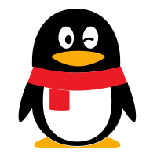

<h5 align="right" style="display: 'flex'; align-items: center;">
  <code></code>
  <code></code>
  <code></code>
  <code></code>
</h5>

#

  
   

  
#
  
- 🔭 I'm currently working on some projects using react, vue, nodejs and so on.
- 🌱 I'm currently learning Javascript.
- 💬 Ask me about anything about web.
- 📫 How to reach me: adajulyforever@gmail.com.

<h4 align="center">
  <a href="https://github.com/adajuly?tab=repositories" title="Show Repositories">🔎 Show More 🔍</a>
</h4>
